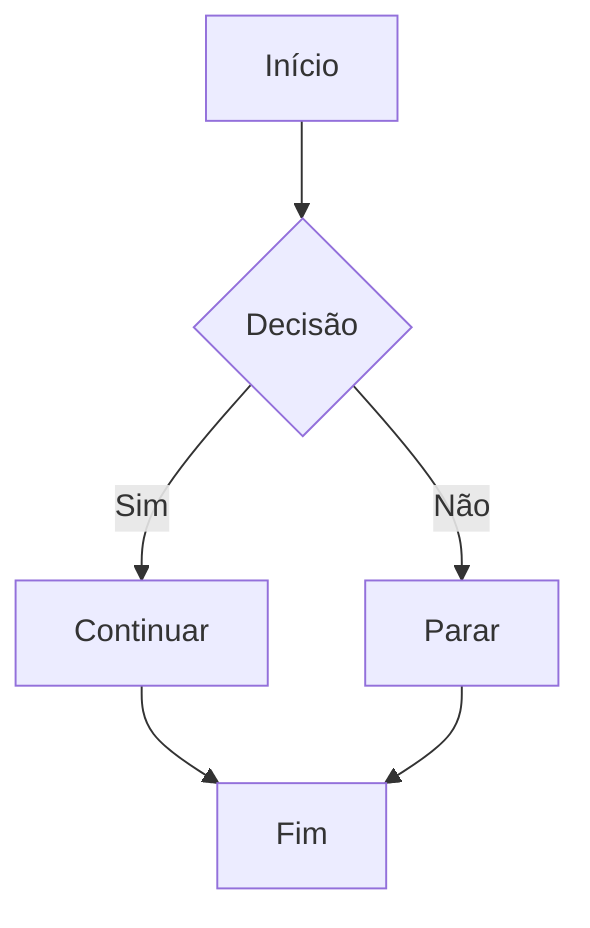
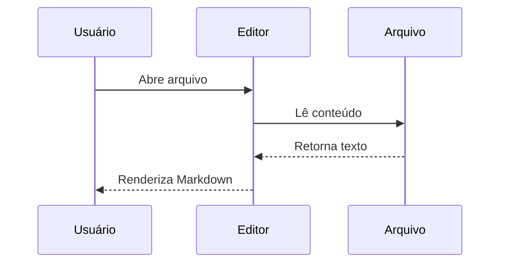

# Teste: Mermaid e KaTeX

## Diagrama Mermaid

## Sequência Mermaid

## Fórmulas KaTeX

Fórmula inline: $E = mc^2$ é a equação de Einstein.

A soma de Gauss: $\sum_{i=1}^{n} i = \frac{n(n+1)}{2}$

Bloco de equação:

$$
\int_0^\infty e^{-x^2} dx = \frac{\sqrt{\pi}}{2}
$$

Matriz:

$$
\begin{pmatrix}
a & b \\
c & d
\end{pmatrix}
\begin{pmatrix}
x \\
y
\end{pmatrix}
=
\begin{pmatrix}
ax + by \\
cx + dy
\end{pmatrix}
$$
