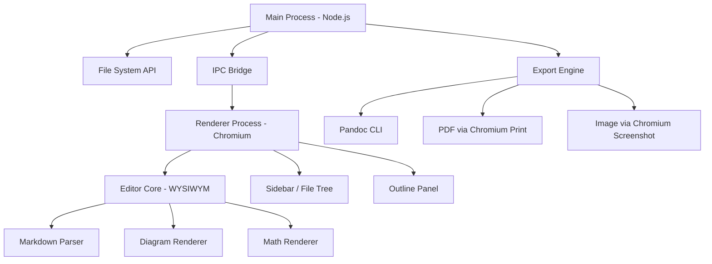

# TypeMarkLee — Especificação Completa

2026-09-17 · @Someone

Base documental para construção do TypeMarkLee: clone funcional do Typora com features turbinadas, a partir de engenharia reversa completa do produto original.

## Objetivo e Escopo

O TypeMarkLee é um editor Markdown desktop com live preview, construído como clone funcional do Typora 1.14 e preparado para features adicionais em fases posteriores. O objetivo desta fase é paridade total de funcionalidades com o Typora antes de qualquer turbinamento.

**Referência de produto:** Typora v1.14 (jul/2026), licença proprietária a $14.99, suporte a Windows/macOS/Linux.

**Premissas desta fase:**

- Replicar 100% das features documentadas do Typora
- Interface desktop nativa (não web app)
- Arquivos `.md` como fonte da verdade (compatibilidade total com GFM)
- Extensível por CSS/temas como o Typora
- Base técnica que permita turbinamentos: colaboração, IA, plugins, cloud sync

**Fora de escopo (Fase 1):**

- Colaboração em tempo real
- Integração com IA
- Sincronização com cloud (apenas suporte a Dropbox/iCloud via pasta local)
- App mobile

## Especificação Funcional

### 1. Editor com Live Preview (WYSIWYM)

O coração do Typora é a ausência de dual-pane (source + preview separados). O editor opera em modo WYSIWYM — *What You See Is What You Mean*: o Markdown é renderizado instantaneamente no lugar da sintaxe ao mover o cursor para fora do bloco.

**Comportamento esperado:**

- Ao digitar `## Título` e pressionar Enter, o bloco se transforma no heading visual; ao clicar nele, volta ao Markdown editável
- Negrito, itálico, código inline, links e imagens são renderizados inline durante a escrita
- Modo **Source Code** (Ctrl+/) exibe o Markdown bruto completo — alternância sem perda de dados
- **Focus Mode** (F8): escurece todas as linhas exceto a atual para concentração
- **Typewriter Mode** (F9): mantém a linha ativa sempre no centro vertical da janela
- **Fullscreen** (F11 / Cmd+Option+F)
- Auto-pair de delimitadores: `()`, `[]`, `{}`, `""`, `''`, `**`, `_`, `` ` `` (configurável)

---

### 2. Suporte Markdown (GFM + Extensões)

**Elementos de bloco:**

| Elemento | Sintaxe | Observação |
| --- | --- | --- |
| Parágrafo | texto simples | Enter cria novo parágrafo |
| Headings H1–H6 | `#` a `######` | Atalho Ctrl+1 a Ctrl+6 |
| Blockquote | `>` | Aninhamento suportado |
| Lista não-ordenada | `* / + / -` |  |
| Lista ordenada | `1.` |  |
| Task list | `- [ ] / - [x]` | Checkbox clicável |
| Code fence | ```` ``` ```` + linguagem | Syntax highlight |
| Math block | `$$` + LaTeX | MathJax |
| Tabela | pipe syntax | GUI de edição |
| Footnote | `[^id]:` | MultiMarkdown |
| Horizontal rule | `***` ou `---` |  |
| YAML Front Matter | `---` no topo | Metadados do documento |
| TOC | `[toc]` | Auto-atualizado |
| Callouts/Alerts | GitHub style | Requer ativação |

**Elementos inline:**

| Elemento | Sintaxe | Requer ativação |
| --- | --- | --- |
| Link inline | `[texto](url)` | Não |
| Link referência | `[texto][id]` | Não |
| Link interno | `[texto](#heading)` | Não |
| Imagem | `` | Não |
| Negrito | `**texto**` | Não |
| Itálico | `*texto*` | Não |
| Código inline | `` `código` `` | Não |
| Strikethrough | `~~texto~~` | Não |
| Emoji | `:smile:` | Não |
| Math inline | `$LaTeX$` | Sim (Preferences) |
| Subscript | `~texto~` | Sim |
| Superscript | `^texto^` | Sim |
| Highlight | `==texto==` | Sim |
| Underline | `<u>texto</u>` | HTML direto |
| HTML inline | qualquer tag | Suporte parcial |
| Embed iframe | `<iframe>` | Suporte |
| Vídeo | `<video src>` | Suporte |

---

### 3. Gerenciamento de Imagens

- Inserção por: escrita de Markdown, drag & drop, menu Format → Image, colar do clipboard
- Suporte a path relativo, absoluto e URL remota
- **Cópia automática** de imagens para pasta configurável ao inserir
- **Upload automático** para servidor/cloud ao inserir (via PicGo ou ferramentas configuráveis)
- Operações de contexto: mover, copiar, renomear, deletar imagem do disco
- **Move/Copy All Images**: move ou copia todas as imagens do documento para uma pasta
- **Download All Images**: baixa imagens remotas e atualiza referências para local
- Configuração de prefixo de URL (`typora-root-url` no YAML)
- Escape automático de path de imagem (opcional)
- Resize de imagens no editor
- Imagens únicas num parágrafo são centralizadas automaticamente (comportamento CSS configurável)

---

### 4. Diagramas

Todos os diagramas são habilitados em Preferences → Markdown → Diagrams.

**js-sequence** (bloco ```` ```sequence ````):

- Diagramas de sequência com tema `simple` ou `hand` (variável CSS `--sequence-theme`)

**flowchart.js** (bloco ```` ```flow ````):

- Fluxogramas com nós: start, end, operation, condition, inputoutput, subroutine

**Mermaid** (bloco ```` ```mermaid ````) — tipos suportados:

| Tipo | Palavras-chave |
| --- | --- |
| Sequence | `sequenceDiagram` |
| Flowchart | `graph LR/TD` |
| Gantt | `gantt` |
| Class | `classDiagram` |
| State | `stateDiagram` |
| Pie | `pie` |
| Requirement | `requirementDiagram` |
| Gitgraph | `gitGraph` |
| C4/PlantUML | `C4Context` |
| Mindmap | `mindmap` |
| Timeline | `timeline` |
| Quadrant | `quadrantChart` |
| Sankey | `sankey-beta` |
| ZenUML | `zenuml` |
| XY Chart | `xychart-beta` |

**Opções globais Mermaid** (via Custom CSS):

- `--mermaid-theme`: default, base, dark, forest, neutral, night
- `--mermaid-font-family`
- `--mermaid-sequence-numbers`: on/off
- `--mermaid-flowchart-curve`: linear, basis, natural, step
- `--mermaid--gantt-left-padding`
- Inline config via `%%{init: ...}%%`

**Exportar diagrama:** botão direito → Save as SVG / PNG / JPG; ou Copy to clipboard.

---

### 5. Tabelas

- Criação via GUI: `| Col1 | Col2 |` + Enter
- Toolbar contextual ao focar na tabela: redimensionar, alinhar colunas, deletar
- Alinhamento por coluna: `:---` (esquerda), `:---:` (centro), `---:` (direita)
- Markdown interno: links, bold, itálico, strikethrough
- Atalhos: Ctrl+T (nova tabela), Ctrl+L (selecionar linha), Ctrl+Shift+Backspace (deletar linha)

---

### 6. Gerenciamento de Arquivos

**Sidebar** (Ctrl+Shift+L para toggle): três modos:

1. **Outline Panel** — TOC do documento atual com navegação por clique
2. **File Tree** — hierarquia de pastas, apenas arquivos suportados
3. **File List** — lista plana de arquivos da pasta aberta

**Operações na sidebar:**

- Novo arquivo/pasta, duplicar, renomear, deletar (move para lixeira)
- Copy File Path, Reveal in Explorer/Finder
- Drag & drop entre pastas e entre Explorer/Finder e sidebar
- Drag de arquivo para área de escrita insere link para o arquivo

**Ordenação:** alfabética, natural (1, 2, 10), data de modificação, data de criação (crescente/decrescente); agrupar por pasta (on/off)

**Ações de pasta na sidebar:** Refresh (auto-watch ativo), Switch Folder, Pin Folder, Remove from Recent

**Open Quickly** (Ctrl+P / Cmd+Shift+O): busca fuzzy de arquivos na pasta aberta

**Global Search** (Ctrl+Shift+F): busca de texto em todos os arquivos da pasta

**Tags:** não nativamente suportadas — busca por `#tag` via Global Search

**Links entre arquivos:** `[texto](../outro.md#heading)` com criação automática se arquivo não existe

**Recent Files/Folders:** acessíveis pelo menu, Open Quickly e sidebar; pin para não expirar; JumpList no Windows (taskbar)

---

### 7. Exportação

**Formatos nativos** (sem dependência externa):

| Formato | Config disponível |
| --- | --- |
| PDF | Tamanho de papel, margens, tema, header/footer, page break entre H1, metadados, conteúdo customizado, cover page |
| HTML | Com ou sem estilos, outline, custom head/body, tema separado |
| Imagem (PNG/JPG) | Largura, tamanho de fonte, qualidade (Auto/Medium/High/Best), tema |

**Formatos via Pandoc** (requer instalação):

- Word (.docx) com style reference customizável
- OpenOffice (.odt)
- RTF
- Epub (CSS, chapter level, cover image, metadados)
- LaTeX (múltiplos engines: pdflatex, xelatex, lualatex, tectonic, wkhtmltopdf, weasyprint, prince)
- MediaWiki, reStructuredText, Textile, OPML
- Presentation (RevealJS via Pandoc)
- Qualquer formato Pandoc via configuração manual

**Configuração avançada de exportação:**

- Reordenar, renomear, remover items do menu de exportação
- Adicionar novos items: baseados em Pandoc, comando customizado, ou preset
- Variáveis disponíveis: `${title}`, `${author}`, `${outputPath}`, `${currentPath}`, `${today}`, `${pageNo}`, `${pageCount}`, e quaisquer chaves do YAML Front Matter
- Export with Previous (re-exporta com configuração anterior)
- Export and Overwrite with Previous (sobrescreve arquivo exportado)
- Per-file config via YAML Front Matter (requer opção habilitada por segurança)

---

### 8. Temas

- **6 temas built-in**
- Cada tema = um arquivo `.css` na pasta de temas do usuário
- Suporte a **light mode e dark mode** separados (macOS/Windows); CSS media query `prefers-color-scheme`
- Instalação de tema customizado: colocar `.css` (+ assets) na pasta de temas e reiniciar
- Galeria oficial de temas em typora.io/themes
- **Custom CSS** por cima do tema ativo (sem criar novo arquivo de tema)
- Debug de tema via DevTools (Safari no macOS, View → DevTools no Windows/Linux)
- Temas separáveis por exportação: PDF, HTML, Imagem podem usar tema diferente do editor

---

### 9. Atalhos de Teclado

**Arquivo:**

| Ação | Windows/Linux | macOS |
| --- | --- | --- |
| Novo | Ctrl+N | Cmd+N |
| Nova janela | Ctrl+Shift+N | Cmd+Shift+N |
| Nova aba | — | Cmd+T |
| Abrir | Ctrl+O | Cmd+O |
| Open Quickly | Ctrl+P | Cmd+Shift+O |
| Reabrir fechado | Ctrl+Shift+T | Cmd+Shift+T |
| Salvar | Ctrl+S | Cmd+S |
| Salvar como | Ctrl+Shift+S | Cmd+Shift+S |
| Fechar | Ctrl+W | Cmd+W |

**Edição:**

| Ação | Windows/Linux | macOS |
| --- | --- | --- |
| Selecionar linha/sentença | Ctrl+L | Cmd+L |
| Selecionar célula (tabela) | Ctrl+E | Cmd+E |
| Selecionar palavra | Ctrl+D | Cmd+D |
| Buscar | Ctrl+F | Cmd+F |
| Substituir | Ctrl+H | Cmd+H |
| Ir ao topo | Ctrl+Home | Cmd+↑ |
| Ir ao fim | Ctrl+End | Cmd+↓ |
| Ir para seleção | Ctrl+J | Cmd+J |

**Parágrafo:**

| Ação | Windows/Linux | macOS |
| --- | --- | --- |
| H1–H6 | Ctrl+1–6 | Cmd+1–6 |
| Parágrafo | Ctrl+0 | Cmd+0 |
| Aumentar heading | Ctrl+= | Cmd+= |
| Diminuir heading | Ctrl+- | Cmd+- |
| Tabela | Ctrl+T | Cmd+Option+T |
| Code fence | Ctrl+Shift+K | Cmd+Option+C |
| Math block | Ctrl+Shift+M | Cmd+Option+B |
| Blockquote | Ctrl+Shift+Q | Cmd+Option+Q |
| Lista ordenada | Ctrl+Shift+\[ | Cmd+Option+O |
| Lista não-ordenada | Ctrl+Shift+\] | Cmd+Option+U |
| Indentar | Ctrl+\[ / Tab | Cmd+\[ / Tab |
| Desindentar | Ctrl+\] / Shift+Tab | Cmd+\] / Shift+Tab |

**Formato:**

| Ação | Windows/Linux | macOS |
| --- | --- | --- |
| Negrito | Ctrl+B | Cmd+B |
| Itálico | Ctrl+I | Cmd+I |
| Sublinhado | Ctrl+U | Cmd+U |
| Código | Ctrl+Shift+\` | Cmd+Shift+\` |
| Strikethrough | Alt+Shift+5 | Ctrl+Shift+\` |
| Hyperlink | Ctrl+K | Cmd+K |
| Imagem | Ctrl+Shift+I | Cmd+Ctrl+I |
| Limpar formato | Ctrl+\\ | Cmd+\\ |

**View:**

| Ação | Windows/Linux | macOS |
| --- | --- | --- |
| Toggle sidebar | Ctrl+Shift+L | Cmd+Shift+L |
| Outline | Ctrl+Shift+1 | Cmd+Ctrl+1 |
| Articles | Ctrl+Shift+2 | Cmd+Ctrl+2 |
| File tree | Ctrl+Shift+3 | Cmd+Ctrl+3 |
| Source code mode | Ctrl+/ | Cmd+/ |
| Focus mode | F8 | F8 |
| Typewriter mode | F9 | F9 |
| Fullscreen | F11 | Cmd+Option+F |
| DevTools | Shift+F12 | — |

**Personalização de atalhos:** via System Preferences (macOS) ou `conf.user.json` (Windows/Linux).

---

### 10. Preferências e Configurações

**Seções do painel de preferências:**

- **General:** linguagem, comportamento de abertura (reabrir último arquivo, pasta padrão), tema de interface, janela sempre no topo
- **Editor:** auto-pair de delimitadores e Markdown, font family/size, line height, word count, spell check
- **Image:** comportamento padrão ao inserir imagem (copiar para pasta, upload), path relativo, escape automático
- **Markdown:** extensões opcionais (inline math, subscript, superscript, highlight, callouts/alerts), diagramas, whitespace/line break behavior
- **Export:** configurar items de exportação, pandoc path, comportamento pós-export (abrir arquivo, abrir pasta)
- **Appearance:** modo claro/escuro automático, tema por modo
- **Account/License:** ativação da licença em até 3 dispositivos

**Word Count:** palavras, caracteres, linhas, minutos de leitura — visível no rodapé e em hover.

**Zoom:** Ctrl+Shift+= / Ctrl+Shift+- (Windows/Linux); não suportado no macOS via atalho, mas via acessibilidade do sistema.

## Especificação Não-Funcional

### Plataformas

| Plataforma | Versão mínima | Arquitetura |
| --- | --- | --- |
| Windows | Windows 10 | x64, x86 (32-bit), ARM |
| macOS | macOS 10.14 (Mojave) | Intel + Apple Silicon (Universal) |
| Linux | Ubuntu 18.04 / equivalente | x64, ARM |

O Typora distribui binários separados por plataforma. O TypeMarkLee deve replicar esse suporte.

### Performance

- **Abertura de arquivo:** < 200ms para arquivos de até 1 MB
- **Renderização live preview:** latência imperceptível (< 50ms) para edições incrementais
- **Exportação PDF:** < 5s para documentos de até 50 páginas (nativo); tempo variável para Pandoc (depende do engine)
- **Global Search:** < 1s para pastas com até 1.000 arquivos
- **Exportação de imagem:** falha graciosamente para documentos muito longos (limite documentado)
- **Memory footprint:** comparável a um Electron/Tauri app — < 200MB em uso típico

### Confiabilidade

- Auto-save configurável (ou save explícito via Ctrl+S)
- Recuperação de arquivo em caso de crash (backup temporário)
- Undo/redo ilimitado durante a sessão
- Undo de operações de arquivo (mover, renomear, deletar) — com limitações documentadas por OS
- Watch de sistema de arquivos: sidebar atualiza automaticamente quando arquivos mudam externamente

### Segurança

- Configurações de exportação via YAML Front Matter requerem opt-in explícito (evita execução de código injetado em arquivos de terceiros)
- Comandos de exportação customizados executados na pasta do arquivo atual (não como root)
- Sem telemetria obrigatória; sem coleta de conteúdo dos documentos
- Licença por dispositivo (até 3 devices) — ativação online

### Acessibilidade

- Suporte a zoom de interface (Windows/Linux: Ctrl+Shift+= / -)
- Font family e size configuráveis pelo usuário
- Line height configurável
- Focus Mode para redução de distrações cognitivas
- Modo escuro/claro com seguimento automático do sistema
- Atalhos de teclado customizáveis para todos os comandos do menu

### Compatibilidade de Arquivos

- Formato nativo: `.md` (UTF-8) — compatível com qualquer editor Markdown
- Leitura/edição: `.md`, `.markdown`, `.txt`
- Import via Pandoc: `.docx`, `.rtf`, e outros formatos Pandoc
- Sem formato proprietário — o documento pertence ao usuário

### Localização

- Interface em múltiplos idiomas (Typora suporta \~20+ idiomas)
- Typora tem site em Chinês (`typora.io/zh/`) — TypeMarkLee deve considerar pelo menos PT-BR, EN, ZH

### Licenciamento (referência)

- Typora: $14.99 one-time, até 3 dispositivos, 15 dias de trial
- TypeMarkLee Fase 1: definir modelo (open source, freemium ou paid) — **a definir com o produto**

## Especificação Técnica

### Stack Recomendada

O Typora é construído com **Electron** (Node.js + Chromium). Para o TypeMarkLee, as opções viáveis são:

| Framework | Prós | Contras |
| --- | --- | --- |
| **Electron** | Paridade total com Typora; CSS themes nativos; DevTools built-in; maturidade | Bundle pesado (\~150MB); consumo de memória maior |
| **Tauri** (Rust + WebView) | Bundle pequeno (\~5MB); performance de memória superior; Rust para backend | WebView varia por OS (Webkit/WebKit2/Edge); menos maturidade |
| **Neutralino.js** | Ultraleve; sem Node.js embutido | Menos features; ecossistema menor |

**Recomendação para Fase 1:** Electron — garante paridade de renderização CSS, DevTools acessível ao usuário para debug de temas, e ecossistema maduro. Considerar Tauri para Fase 2 se performance for prioridade.

### Arquitetura Geral



### Parser Markdown

O Typora usa um parser customizado compatível com **GitHub Flavored Markdown (GFM)**. Para o TypeMarkLee:

- **Opção A: [markdown-it](https://github.com/markdown-it/markdown-it)** — referência de performance, plugin ecosystem rico, compatível com GFM + extensões (footnotes, subscript, sup, highlight, task list, math)
- **Opção B: [unified/remark](https://unifiedjs.com/)** — AST-based, extensível, mas mais complexo de integrar com live preview
- **Recomendação:** `markdown-it` com plugins:
  - `markdown-it-footnote`
  - `markdown-it-sub` / `markdown-it-sup`
  - `markdown-it-mark` (highlight)
  - `markdown-it-task-lists`
  - `markdown-it-front-matter`
  - `markdown-it-toc-done-right`
  - `markdown-it-attrs` (para callouts/alerts)

### Renderização WYSIWYM

Esta é a feature mais complexa e diferenciadora. O Typora não usa dois panes — ele edita o DOM diretamente.

**Abordagem recomendada:**

- Usar **[ProseMirror](https://prosemirror.net/)** ou **[CodeMirror 6](https://codemirror.net/)** como base do editor
- ProseMirror tem o modelo mental correto: schema de documento, decorations, e view layer separado do model — permite renderizar Markdown visualmente enquanto mantém a fonte como texto puro
- O Typora usa uma abordagem similar: o cursor dentro de um bloco abre a sintaxe Markdown; mover o cursor para fora dispara a renderização
- Alternativa avaliada: **[Milkdown](https://milkdown.dev/)** (ProseMirror-based, Markdown-first) — pode acelerar o desenvolvimento

### Renderização de Diagramas

| Biblioteca | Tipo de diagrama | Versão (Typora 1.14) |
| --- | --- | --- |
| [Mermaid](https://mermaid.js.org/) | sequence, flowchart, gantt, class, state, pie, gitgraph, mindmap, timeline, C4, quadrant, sankey, zenuml, xychart | Latest stable |
| [js-sequence-diagrams](https://bramp.github.io/js-sequence-diagrams/) | Sequence (legado, tema hand/simple) | — |
| [flowchart.js](https://flowchart.js.org/) | Flowchart (legado) | — |

### Renderização Matemática

- **[MathJax](https://www.mathjax.org/)** (Typora é supporter oficial do MathJax)
- Suporte a blocos `$$...$$` e inline `$...$`
- LaTeX completo: matrizes, equações, símbolos
- Alternativa mais leve: **[KaTeX](https://katex.org/)** — subset de LaTeX, mas muito mais rápido; avaliar se cobre os casos de uso

### Sistema de Arquivos

- **Node.js `fs`** para leitura/escrita/watch
- **`chokidar`** para watch de mudanças externas (sidebar auto-refresh)
- Encoding: UTF-8 padrão; detectar BOM
- Undo de operações de arquivo: manter pilha de operações (move, rename) e reverter via `fs`

### Exportação

| Formato | Engine |
| --- | --- |
| PDF | `window.print()` via Chromium (com CSS @media print) ou `puppeteer` headless |
| HTML | Template HTML + injeção do conteúdo renderizado + CSS do tema |
| Imagem | `html-to-image` ou Chromium screenshot com largura configurável |
| Word/Epub/LaTeX/outros | Pandoc CLI (`child_process.exec`) |

**Pandoc integration:** detectar path, versão mínima, executar com args configurados, capturar stdout/stderr para mostrar erros ao usuário.

### Sistema de Temas

- Um tema = um `.css` carregado no `<head>` do renderer
- Pasta de temas do usuário monitorada; novo CSS disponível após restart (ou hot-reload opcional)
- Custom CSS adicional: injetado após o tema base (arquivo `base.user.css` ou `{theme}.user.css`)
- CSS Variables como tokens do tema: cores, fontes, espaçamentos — facilitam suporte a dark mode via `prefers-color-scheme`

### Armazenamento de Configuração

- Preferências do usuário: JSON em `app.getPath('userData')` (Electron)
- Temas: pasta `themes/` em `userData`
- Licença/ativação: armazenamento seguro via `keytar` ou `electron-store` com criptografia
- Export settings: JSON em `userData/export.json`
- Custom key bindings: `conf.user.json` em `userData`

### Integração com Pandoc

- Detecção automática do PATH do sistema
- Configuração manual do path nas preferências
- Pipeline: Typora → Pandoc AST (formato `native`) → Pandoc → formato alvo
- Suporte a templates, variáveis de metadados, argumentos extras
- Versão mínima recomendada: Pandoc 2.x+

### Distribuição

| Plataforma | Formato |
| --- | --- |
| Windows | NSIS installer (.exe) + portable ZIP; considerar MSIX para Microsoft Store |
| macOS | .dmg com .app assinado (Apple notarization obrigatório) |
| Linux | .deb, .rpm, AppImage |

**Auto-update:** `electron-updater` (Squirrel) — servidor de atualização próprio ou GitHub Releases.

### Considerações para Turbinamentos Futuros

A arquitetura deve acomodar sem refatoração maior:

- **Colaboração em tempo real:** substituir file-based storage por CRDT (Yjs ou Automerge) com sync server
- **Integração com IA:** plugin de sugestão/completions via API (hook no editor ProseMirror)
- **Plugin system:** API pública de extensão do editor (similar ao Obsidian plugin API)
- **Cloud sync:** abstração da camada de FS para suportar S3, Dropbox API, WebDAV
- **Tabs múltiplas:** já suportado no Typora (macOS); garantir desde o início no Electron via `BrowserWindow` múltiplas ou single-window com tab emulation
